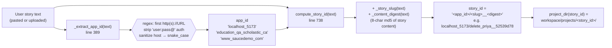
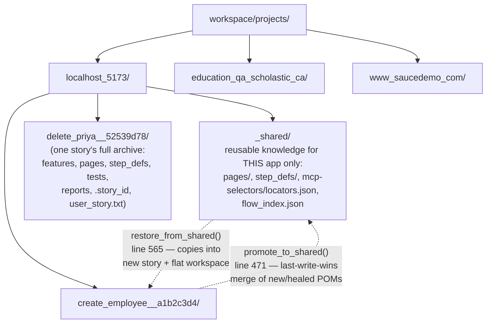

# Agent Flow — Internal Pipeline & Project Isolation

This document explains **how the codebase works internally** — not the UI.
It covers two things:

1. **How a user story's URL becomes a uniquely-identified, isolated project**
   under `workspace/projects/`, so that every application-under-test keeps its
   own automation framework (POMs, step defs, selectors, reports) completely
   separate from every other application's.
2. **What the code actually does, step by step**, when the three pipeline
   buttons run — which functions fire, in what order, and which files they
   read/write.

All line references point at `core/agent_ui.py`.

---

## 1. One application = one project, identified by its URL

The agent never asks the user to name a project. It **derives a stable
identity from the first URL found in the story text**, so that pasting a story
for `https://www.saucedemo.com/...` always lands in the same project folder —
today, tomorrow, or a year from now — regardless of who pastes it or how the
story is worded.



**Key guarantees this gives you:**

- **Same app → same folder, always.** `_extract_app_id` (line 389) only looks
  at the URL host (auth and path stripped), so `http://localhost:5173/login`
  and `http://localhost:5173/dashboard` both resolve to `localhost_5173`.
- **Same story → same cached artifacts.** `compute_story_id` (line 738) first
  scans existing project folders for a `.story_id` sidecar whose content digest
  matches — if found, it re-binds to that folder instead of creating a new one,
  so re-pasting an unchanged story always serves the cached `.feature`/POM/test
  files rather than regenerating them.
- **Different apps never collide.** Because `app_id` is always the first path
  segment, two stories that happen to use the same verbs ("login", "search",
  "add to cart") but target different hosts land in entirely separate
  directory trees — their POMs, selectors, and reports never mix.

---

## 2. Folder isolation layout — what lands where



Two isolation boundaries matter here:

- **Across apps** (`localhost_5173/` vs `education_qa_scholastic_ca/` vs
  `www_saucedemo_com/`): each `app_id` directory is a hermetically separate
  project — its own `_shared/` knowledge base, its own story archives, its own
  reports. Deleting or relocating one app's folder never touches another's.
- **Within an app, across stories**: `_shared/` is the **app-level knowledge
  base** — POMs and step defs that *every* story for that app can reuse (e.g.
  the login flow, navigation chrome). Each individual story additionally gets
  its own archive folder (`<slug>__<digest>/`) holding the exact files that
  were generated/run for that specific story, plus its own `reports/runs/`
  history.

`core/` (the engine) never contains any of this — see
[`WORKSPACE_DIR` / `PROJECTS_DIR`](#4-where-the-engine-and-the-knowledge-base-live)
below for how that separation is enforced in code.

---

## 3. The three-step pipeline — internal call sequence

This is what actually happens, function by function, when a story is loaded
and the three pipeline buttons are clicked in order. `core/agent_ui.py`
line numbers are shown for each call.

```mermaid
sequenceDiagram
    participant Story as user_story.txt
    participant UI as render_sidebar()<br/>(line 3684)
    participant KB as workspace/projects/<br/>&lt;app_id&gt;/
    participant CLI as Claude Code CLI<br/>(subprocess, stream-json)
    participant WS as core/ workspace dirs<br/>(features, pages, step_defs, tests)
    participant PT as pytest + Playwright

    Note over Story,UI: Story is uploaded or pasted
    UI->>UI: _write_pytest_ini(_extract_base_url(text))  — line 3701/3728
    UI->>UI: compute_story_id(text) → story_id  — line 4232
    UI->>KB: restore_from_shared(story_id)  — line 4316
    KB-->>WS: copy _shared/{pages, step_defs, mcp-selectors} → workspace + story archive

    rect rgb(225,240,255)
    Note over UI,CLI: ① Generate Gherkin
    UI->>CLI: claude_command(GHERKIN_PROMPT, GHERKIN_TOOLS)  — line 4558<br/>tools: Write, Read, Edit, Glob (no browser)
    CLI-->>WS: write features/story_N_&lt;slug&gt;.feature
    UI->>KB: archive_artifacts(story_id, "gherkin")  — line 4565
    end

    rect rgb(255,242,225)
    Note over UI,CLI: ② Generate Test Framework
    UI->>UI: app_shared_has_work(app_id)? → choose<br/>FRAMEWORK_DELTA_PROMPT (extend) or FRAMEWORK_PROMPT (fresh)  — line 4664/4668
    UI->>CLI: claude_command(prompt, BUILD_TOOLS)  — line 4672<br/>tools: + Bash + mcp__playwright__* (live MCP selector discovery)
    CLI-->>WS: write pages/page_*.py, step_defs/*_steps.py,<br/>tests/test_*.py, mcp-selectors/locators.json
    UI->>WS: sync_pytest_plugins()  — line 4680<br/>(registers new step_def modules in conftest.py)
    UI->>KB: archive_artifacts(story_id, "framework")  — line 4736
    UI->>KB: promote_to_shared(story_id)  — line 4741<br/>(merges new/healed POMs back into _shared/)
    end

    rect rgb(232,250,232)
    Note over UI,PT: ③ Run All Tests
    UI->>WS: sync_pytest_plugins()  — line 4776
    UI->>PT: stream_command("pytest --headed ...")  — line 4785<br/>(no LLM — direct subprocess)
    PT-->>WS: captured_values.json, step_trace.json,<br/>screenshots/, allure-result/
    UI->>UI: write_inline_coverage_report(story_id, exit_code)  — line 4799
    UI->>KB: archive_artifacts(story_id, "run") + promote_to_shared(story_id)  — line 4815/4820
    end

    UI-->>Story: verdict banner (PASS/PARTIAL/FAIL/BLOCKED) + per-row evidence
```

**What to notice in this sequence:**

- **`restore_from_shared` runs once, before step ①** — every story for an
  app starts by inheriting that app's accumulated POMs/step defs/selectors,
  which is what lets ② run in cheap **DELTA mode** instead of regenerating
  the whole framework from scratch.
- **`archive_artifacts` runs after every phase** (gherkin / framework / run),
  snapshotting the current workspace state into the story's own folder under
  `workspace/projects/<app_id>/<story_id>/` — this is the durable, replayable
  record of exactly what was generated and run.
- **`promote_to_shared` runs after ② and ③** — any new or "healed" selectors
  discovered during this story's run get folded back into `_shared/`
  (last-write-wins per filename), so the *next* story for the same app starts
  from an even better baseline.
- **Only ① and ② talk to the LLM** (`claude_command` → Claude Code CLI
  subprocess in `--output-format stream-json` mode, line 2767). **③ is pure
  Python + pytest** — no LLM involvement, which is why it's fast and
  deterministic (`stream_command`, line 2588).
- **Tool allowlists scope what each phase can do** (lines 103–133):
  `GHERKIN_TOOLS` (file-only — no browser), `BUILD_TOOLS` (adds Bash + the
  `mcp__playwright__*` family for live DOM discovery), `SCOUT_TOOLS` /
  `AUDITOR_TOOLS` (optional multi-agent paths, opt-in, not shown above).

---

## 4. Where the engine and the knowledge base live

The separation between "shippable code" and "per-client data" is enforced by
two path constants near the top of `agent_ui.py` (lines 51–53):

```python
WORKSPACE_DIR = Path(os.environ.get("QA_WORKSPACE_DIR", PROJECT_ROOT.parent / "workspace"))
PROJECTS_DIR  = WORKSPACE_DIR / "projects"
PROMPTS_DIR   = PROJECT_ROOT / "prompts"
```

| Constant | Default | Contains |
|---|---|---|
| `PROJECT_ROOT` | `core/` | The engine: `agent_ui.py`, `conftest.py`, `pytest.ini`, `prompts/*.md`, framework templates (`base_page.py`, etc.) — **zero app-specific data** |
| `WORKSPACE_DIR` | sibling `workspace/` next to `core/` (override with `QA_WORKSPACE_DIR` env var) | The per-client knowledge base — everything described in sections 1–2 above |
| `PROMPTS_DIR` | `core/prompts/` | The 9 LLM prompt templates as editable `.md` files (loaded via `_load_prompt`, so tuning agent behavior never requires touching Python) |

Because every one of the ~20 functions that touch project data derives its
path from `PROJECTS_DIR`, **pointing `QA_WORKSPACE_DIR` at a different
location instantly relocates the entire knowledge base** — useful for running
the same `core/` engine against multiple clients' data without any code change.

---

## 5. `pytest.ini` auto-targeting

One more piece of automatic project-awareness: every time a story is
uploaded or pasted, `_write_pytest_ini(_extract_base_url(text))`
(lines 412–437) rewrites `core/pytest.ini`'s `base_url` to the first URL found
in the story — preserving `testpaths`/`addopts`/`markers`/comments untouched.
This means the pytest run in step ③ always targets the application the
*current* story describes, with no manual `.ini` editing between projects.
